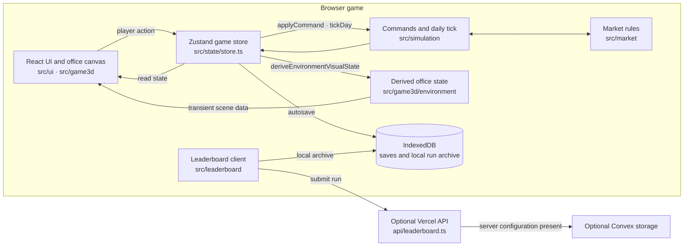

# Compounding

**StartupSim is a management game about building an AI company: staff the work, ship products, compete for customers, and keep the company alive as its office grows.**

<p align="center">
  <a href="https://startupsim.me">Open the browser build ↗</a>
  &nbsp;·&nbsp;
  <a href="#quick-start">Run locally</a>
  &nbsp;·&nbsp;
  <a href="#architecture">See how it works</a>
</p>

<p align="center"><sub>The repository is named <code>StartupSim</code>; <strong>Compounding</strong> is the in-game title.</sub></p>

<table>
  <tr>
    <td align="center" width="50%">
      <strong>01 · Start in the apartment</strong><br />
      
    </td>
    <td align="center" width="50%">
      <strong>02 · Build the first product</strong><br />
      
    </td>
  </tr>
  <tr>
    <td align="center"><sub>Manage company time, cash, and the people in your first office.</sub></td>
    <td align="center"><sub>Assign a team, track project pace, and prepare a product for launch.</sub></td>
  </tr>
</table>

## The game loop

Start with a founder and a cofounder, choose a product direction, and assign people to product work, research, operations, and growth. Time advances in daily simulation steps. When a product is ready, configure its launch and compete with a rival for customer segments on a turn-based market map.

Cash, runway, compute, hiring, trust, and team burnout all constrain growth. Research and automation open new options, while the office changes from an apartment into larger workspaces as the company develops. Runs can end in several ways; submitting a result to the global leaderboard is optional.

| System | Decisions in play |
| --- | --- |
| **Products** | Pair technologies with markets, assign a team, and choose launch capability, distribution, and deployment. |
| **Market** | Expand into segments, reinforce a position, contest a rival, and respond to their turn. |
| **Company** | Balance cash and runway while hiring, fundraising, buying compute, researching, and automating. |
| **Office** | Grow from an apartment through offices, an AI lab, a campus, and a megacampus. Company state drives the world details. |

### Controls

| Input | Action |
| --- | --- |
| Click a navigation item or office hotspot | Open a company system or inspect an object. |
| `Space` | Pause or resume the simulation. |
| `1` / `2` / `3` / `4` | Set simulation speed to 1× / 2× / 4× / 8×. |

## Architecture

The browser owns the simulation state. UI panels issue commands against that state; the same state feeds the economy, market rules, local saves, and the 3D office. Office details are derived for rendering and are not stored as a second copy of company state.



### One decision, from input to world

1. A panel in [`src/ui/`](src/ui/) dispatches a typed command through [`useGame`](src/state/store.ts).
2. [`src/simulation/commands.ts`](src/simulation/commands.ts) applies decisions; [`tickDay`](src/simulation/tick.ts) advances daily work, company economics, events, and rivals using the run's seeded random state. Market moves use [`src/market/`](src/market/).
3. React panels read the resulting game state. [`deriveEnvironmentVisualState`](src/game3d/environment/environmentVisualState.ts) turns company facts into transient visual cues, and [`DynamicEnvironment`](src/game3d/environment/DynamicEnvironment.tsx) places those cues in the office.
4. The store writes progress to browser IndexedDB through [`src/state/save.ts`](src/state/save.ts). This is separate from the optional server-backed leaderboard.
5. The [`leaderboard client`](src/leaderboard/client.ts) validates the server response and keeps a local run archive when the network is unavailable; the UI labels an unpublished run as local.

### Engineering decisions

#### The office is a view of company state

- **Problem:** Persisting a second set of values for office props could let the simulation and the 3D scene disagree.
- **Approach:** [`deriveEnvironmentVisualState`](src/game3d/environment/environmentVisualState.ts) computes office cues from `GameState` each time they are needed. The result is explicitly transient and is not written into saves.
- **Why:** Company state remains the source of truth for both gameplay and presentation.
- **Trade-off:** The renderer must derive scene details from gameplay data; adding a new visual progression cue means updating this projection and its coverage.

#### Autosaves serialize without writing every intermediate snapshot

- **Problem:** IndexedDB writes are asynchronous. Overlapping writes can complete out of order, allowing an older snapshot to replace a newer one.
- **Approach:** [`writeSave`](src/state/save.ts) holds the newest pending autosave and flushes writes in sequence. A burst of state changes is coalesced to the latest snapshot.
- **Why:** Progress remains local-first without blocking a simulation tick on browser storage.
- **Trade-off:** Intermediate snapshots in a rapid burst are skipped; the newest queued state is what gets persisted.

#### Market previews and resolved moves share the influence calculation

- **Problem:** A preview can mislead a player if it uses a different formula from the action that changes the map.
- **Approach:** [`previewSideAction`](src/market/turns.ts) and [`resolveSideAction`](src/market/turns.ts) both call `actionCalculation` and apply the same market rules.
- **Why:** The displayed influence breakdown and projected control stay tied to the resolution path.
- **Trade-off:** A preview describes the selected move against the current map; it cannot predict later rival decisions.

## Technology

| Responsibility | Implementation |
| --- | --- |
| Browser UI | React, TypeScript, Vite, Tailwind CSS |
| Game state | Zustand and Immer |
| 3D office | Three.js, React Three Fiber, and Drei |
| Local persistence | IndexedDB through `idb` |
| Optional global leaderboard | Vercel API route with an optional Convex HTTP backend |
| Automated checks | Vitest |

The simulated AI models and compute market are game systems. Playing locally does not require an AI provider API key or a backend service.

## Quick start

### Requirements

- Node.js and npm

### Run the game

```bash
npm install
npm run dev
```

Open the local address printed by Vite. The app saves company progress in the browser with IndexedDB.

### Check the project

```bash
npm test
npm run build
```

`npm test` runs the Vitest suite. `npm run build` runs the TypeScript check and creates the Vite bundle in `dist/`.

## Optional leaderboard configuration

The browser game runs without environment variables. Durable global leaderboard storage requires the server-side `CONVEX_SITE_URL` and `STARTUPSIM_LEADERBOARD_TOKEN` values shown in [`.env.example`](.env.example). Configure them for the server deployment; do not expose the token with a `VITE_` prefix.

If the leaderboard API cannot be reached, the client keeps the run in the browser's local archive and reports that it was not published globally. Local saves and local leaderboard records stay on that browser.

## Development inspection

These fixture routes are intended for local visual QA:

| Route | Fixture |
| --- | --- |
| `/?gallery=1` | Browse the authored visual catalog. |
| `/?world=0` through `/?world=5` | Load an unsaved office preview from apartment to megacampus. |
| `/?postmortem=1` | Inspect a late-game postmortem fixture. |

The gallery, world previews, and postmortem fixture are enabled only in development builds.

## Repository map

| Path | Responsibility |
| --- | --- |
| [`src/simulation/`](src/simulation/) | Company state transitions, economy, tasks, progression, events, and endings. |
| [`src/market/`](src/market/) | Turn-based market map, legal moves, previews, and rival turns. |
| [`src/state/`](src/state/) | Zustand store, browser saves, and state migrations. |
| [`src/ui/`](src/ui/) | Onboarding, HUD, systems, product flows, market screens, and results. |
| [`src/game3d/`](src/game3d/) | Office environments, characters, navigation, facilities, and props. |
| [`src/data/`](src/data/) | Game catalogs for technologies, verticals, events, products, and teams. |
| [`src/leaderboard/`](src/leaderboard/) | Scoring, submission checks, API client, and local run archive. |
| [`api/leaderboard.ts`](api/leaderboard.ts) · [`convex/`](convex/) | Optional server endpoint and durable leaderboard backend. |
| [`scripts/`](scripts/) | Browser playthrough and focused visual QA helpers. |
| [`docs/ART_BIBLE.md`](docs/ART_BIBLE.md) · [`docs/ASSET_LICENSES.md`](docs/ASSET_LICENSES.md) | Art direction and asset provenance. |

## Status and reuse

Compounding is a playable browser game under active development. The repository links to [startupsim.me](https://startupsim.me), but its current availability was not verified during this presentation pass. The global leaderboard also depends on server configuration; local play and saves do not.

There is no `LICENSE` file in the repository, so code and asset reuse terms have not been granted. Asset provenance is documented separately in [`docs/ASSET_LICENSES.md`](docs/ASSET_LICENSES.md).
