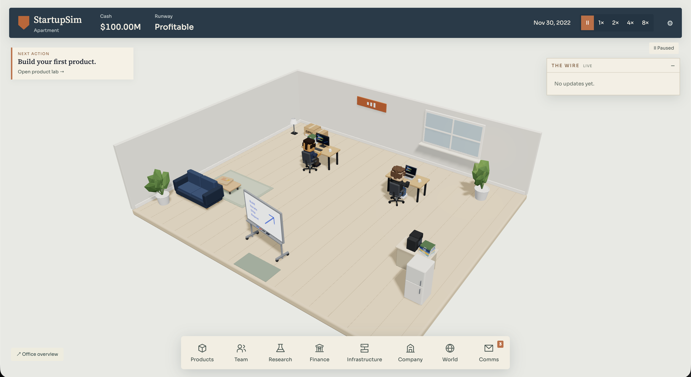
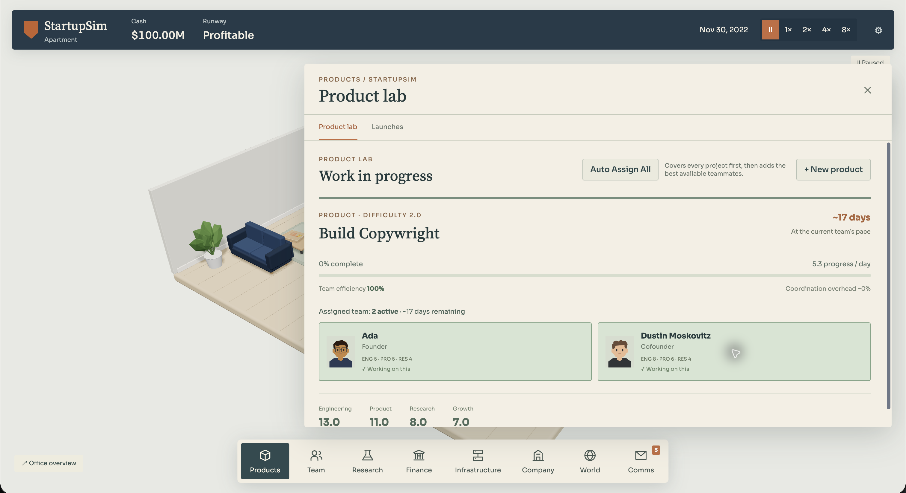

# StartupSim (Compounding)

> Build and ship an AI company, one consequential decision at a time.

StartupSim is a low-poly management simulation about taking an AI company from a
two-laptop apartment to an automated enterprise. The repository is named
`StartupSim`; the current in-game title is **Compounding**.





## What you do

- Combine technologies and verticals to discover products, then build and launch them.
- Assign founders and teammates across product work, research, operations, and growth.
- Choose go-to-market strategies, capture customer segments, and respond to market events.
- Balance cash, runway, hype, trust, compute, hiring, funding, acquisitions, and ownership.
- Expand from an apartment through offices, labs, campuses, and increasingly automated infrastructure.
- Make long-horizon research and automation bets that change both the simulation and the office around you.
- Finish with an ending, achievements, and a leaderboard run that can remain local when the remote service is unavailable.

## Engineering notes

The simulation keeps its rules and state in `src/simulation`, with the UI and 3D
office reading from that state rather than maintaining a separate visual model.
Office progression is derived from company state, so the world can show products,
infrastructure, research, robotics, and culture without putting visual-only data
into save files.

The leaderboard has two explicit persistence paths:

- Browser-local saves use IndexedDB and work without a network connection.
- The Vercel API route can forward validated entries to Convex when the server-only
  `CONVEX_SITE_URL` and `STARTUPSIM_LEADERBOARD_TOKEN` values are configured.

The remote leaderboard is optional. If it is unavailable, the game tells the player
that a run was saved locally rather than claiming it was published globally.

## Built with

- React, TypeScript, and Vite for the application shell.
- React Three Fiber and Three.js for the low-poly office, characters, props, and environments.
- Zustand and IndexedDB for client state and local persistence.
- Vitest for simulation, UI, audio, market, and leaderboard tests.
- Vercel serverless API routes with an optional Convex-backed leaderboard.

## Quick start

### Prerequisites

- Node.js with npm

### Install and run

```bash
npm ci
npm run dev
```

Open the local URL printed by Vite. The core game does not require environment
variables. `.env.example` documents the server-only values used when deploying the
durable leaderboard bridge; do not rename those values with a `VITE_` prefix or
expose them to the browser.

### Verify the repository

```bash
npm test
npm run build
```

`npm test` runs the Vitest suite. `npm run build` type-checks the project and creates
the Vite production bundle in `dist/`.

## Development inspection routes

The gallery, office-world, and postmortem fixtures are development-gated. The
market and results fixtures are deterministic QA helpers; use them locally:

| Route | Use |
| --- | --- |
| `?gallery=1` | Browse the authored visual catalog. |
| `?world=0` through `?world=5` | Load an unsaved office fixture from apartment to megacampus. |
| `?market=1` | Open a deterministic market-flow fixture. |
| `?results=1` | Open a deterministic market-results fixture. |
| `?postmortem=1` | Inspect a late-game postmortem fixture. |

For example:

```text
http://localhost:5173/?world=3
```

## Repository map

| Path | Purpose |
| --- | --- |
| `src/simulation/` | Game state, rules, progression, events, economy, and endings. |
| `src/ui/` | HUD, drawers, onboarding, overlays, market screens, and settings. |
| `src/game3d/` | Office environments, characters, navigation, facilities, and props. |
| `src/leaderboard/` | Scoring, integrity checks, local fallback, and client API calls. |
| `api/` and `convex/` | Serverless leaderboard route and optional durable storage. |
| `scripts/` | Browser playtests, visual inspection, and targeted QA helpers. |
| `docs/ART_BIBLE.md` | Visual source of truth for the 3D art direction. |
| `docs/ASSET_LICENSES.md` | Current asset provenance and licensing notes. |
| `public/assets/audio/README.md` | Runtime music and sound asset notes. |

## Status and limits

This is an actively developed playable prototype, not a claim of production
readiness. The repository contains local tests and a Vite deployment configuration,
but no live demo URL is asserted here until it is independently verified. A
repository license has not been added yet; confirm reuse rights with the author
before redistributing the code or assets.
